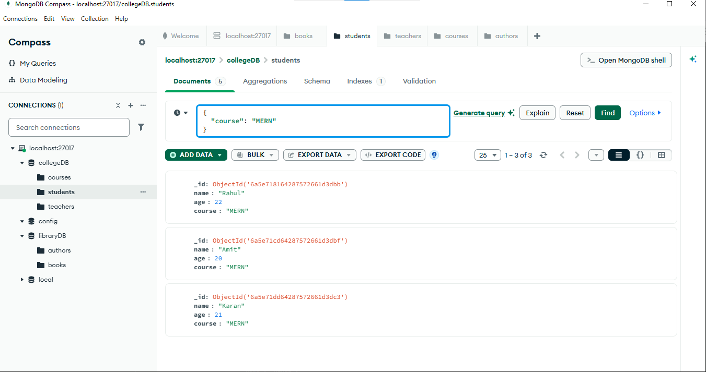
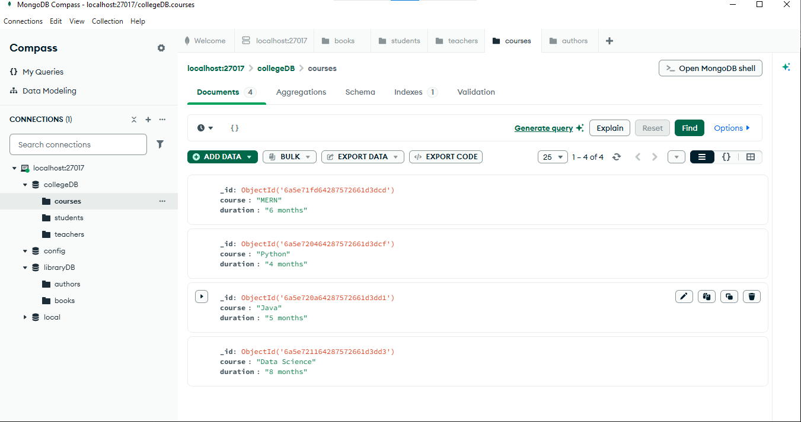

# MongoDB Compass Practice

## Database Created

- collegeDB

## Collections Created

- students
- teachers
- courses

## Sample Documents

### Students

```json
{
  "name": "Rahul",
  "age": 21,
  "course": "MERN"
}
```

### Teachers

```json
{
  "name": "Mr. Khan",
  "subject": "MERN"
}
```

### Courses

```json
{
  "course": "Python",
  "duration": "4 months"
}
```

## Practice Completed

- Created a database
- Created collections
- Inserted student, teacher, and course documents
- Edited one student document
- Deleted one teacher document
- Filtered students by course

## What I Learned

- How to create databases and collections in MongoDB Compass.
- How to insert, edit, and delete documents.
- How to filter documents using queries.
- The difference between databases, collections, and documents.

## Screenshots 


